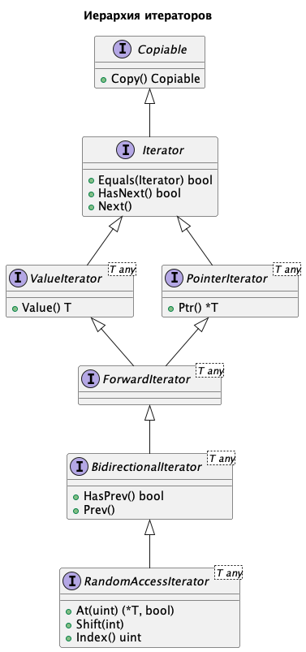

# Containers Library
## Описание

Библиотека containers предоставляет набор [контейнеров](#контейнеры), [адаптеров](#адаптеры), [итераторов](#итераторы) и [алгоритмов](#алгоритмы) для работы с коллекциями в языке Go.

## Установка
Для установки библиотеки используйте команду:

```bash
go get github.com/Delisa-sama/collections
```

## Примеры
Примеры можно посмотреть в файле [examples_test.go](examples_test.go).

## [Copiable](copiable/copiable.go)
Определяет интерфейс для объектов, которые могут быть скопированы.

Для корректной работы алгоритмов, все контейнеры и итераторы обязаны реализовывать интерфейс Copiable.

## Контейнеры
Контейнеры — это объекты, которые служат для хранения других объектов.

Библиотека `collections` предоставляет следующие реализации контейнеров:
### Последовательные
- [**Vector**](#vector)
- [**ForwardList**](#forwardlist)
- [**List**](#list)

### Ассоциативные
- [**Set**](#set)
- [**BST**](#bst)
- [**AVLTree**](#avltree)

## Vector
`Vector` представляет собой динамический массив (вектор), предоставляющий функции для работы с коллекцией элементов.

### Пример использования

```go
package main

import (
	"fmt"

	"github.com/Delisa-sama/collections/sequence/vector"
)

func main() {
	vec := vector.NewVector(1, 2, 3)
	fmt.Println("Размер вектора:", vec.Size())
	fmt.Println("Последний элемент:", vec.Back())
	vec.PushBack(4)
	fmt.Println("Новый размер вектора:", vec.Size())
	vec.PopBack()
	fmt.Println("Размер после удаления:", vec.Size())
}
```

### Конструкторы
#### NewVector
```go
func NewVector[T any](items ...T) *Vector[T]
```
Создает новый Vector и заполняет его переданными элементами.

Time complexity: `O(n)`, где n — количество переданных элементов.

#### NewVectorFromSlice
```go
func NewVectorFromSlice[T any](items []T) *Vector[T]
```
Создает новый Vector на основе переданного слайса, без копирования элементов.

Time complexity: `O(1)`

### Методы
#### Size
```go
func (l *Vector[T]) Size() uint
```
Возвращает количество элементов в векторе.

Time complexity: `O(1)`

#### IsEmpty
```go
func (l *Vector[T]) IsEmpty() bool
```
Проверяет, что вектор пустой.

Time complexity: `O(1)`

#### PushBack
```go
func (l *Vector[T]) PushBack(value T)
```
Добавляет новый элемент в конец вектора.

Time complexity: `O(1)+`

#### Back
```go
func (l *Vector[T]) Back() T
```
Возвращает последний элемент в векторе.

Time complexity: `O(1)`

#### PopBack
```go
func (l *Vector[T]) PopBack()
```
Удаляет последний элемент из вектора.

Time complexity: `O(1)`

#### Copy
```go
func (l *Vector[T]) Copy() copiable.Copiable
```
Возвращает копию вектора.

Time complexity: `O(n)`, где n — количество элементов в векторе.

### Итераторы
#### At
```go
func (l *Vector[T]) At(index uint) interfaces.RandomAccessIterator[T]
```
Возвращает итератор на элемент вектора по переданному индексу.

#### Begin
```go
func (l *Vector[T]) Begin() interfaces.RandomAccessIterator[T]
```
Возвращает итератор на первый элемент вектора.

#### End
```go
func (l *Vector[T]) End() interfaces.RandomAccessIterator[T]
```
Возвращает итератор на последний элемент вектора.

#### RBegin
```go
func (l *Vector[T]) RBegin() interfaces.BidirectionalIterator[T]
```
Возвращает перевернутый итератор на последний элемент вектора.

#### REnd
```go
func (l *Vector[T]) REnd() interfaces.Iterator
```
Возвращает перевернутый итератор на первый элемент вектора.

## ForwardList
ForwardList представляет собой односвязный список, предоставляющий функции для работы с коллекцией элементов.
Пример использования

```go
package main

import (
	"fmt"

	"github.com/Delisa-sama/collections/sequence/forwardlist"
)

func main() {
	fl := forwardlist.NewForwardList(1, 2, 3)
	fmt.Println("Размер списка:", fl.Size())
	fmt.Println("Первый элемент:", fl.Front())
	fl.PushFront(0)
	fmt.Println("Новый размер списка:", fl.Size())
	fl.PopFront()
	fmt.Println("Размер после удаления:", fl.Size())
}
```

### Конструкторы
#### NewForwardList

```go
func NewForwardList[T any](items ...T) *ForwardList[T]
```

Создает новый ForwardList и заполняет его переданными элементами.

Time complexity: `O(n)`, где n — количество переданных элементов.

### Методы
#### Size
```go
func (l *ForwardList[T]) Size() uint
```
Возвращает количество элементов в списке.

Time complexity: `O(1)`

#### IsEmpty
```go
func (l *ForwardList[T]) IsEmpty() bool
```

Проверяет, что список пустой.

Time complexity: `O(1)`

#### PushFront
```go
func (l *ForwardList[T]) PushFront(value T)
```

Добавляет новый элемент в начало списка.

Time complexity: `O(1)`

#### Front
```go
func (l *ForwardList[T]) Front() T
```

Возвращает первый элемент в списке.

Time complexity: `O(1)`

#### PopFront
```go
func (l *ForwardList[T]) PopFront()
```

Удаляет первый элемент из списка.

Time complexity: `O(1)`

#### Copy
```go
func (l *ForwardList[T]) Copy() copiable.Copiable
```
Возвращает копию списка.

Time complexity: `O(n)`, где n — количество элементов в списке.

### Итераторы
#### Begin
```go
func (l *ForwardList[T]) Begin() interfaces.ForwardIterator[T]
```
Возвращает итератор на первый элемент списка.

#### End
```go
func (l *ForwardList[T]) End() interfaces.Iterator
```
Возвращает итератор на конец списка.

## List
List представляет собой двусвязный список, предоставляющий функции для работы с коллекцией элементов.

### Пример использования
```go
package main

import (
	"fmt"

	"github.com/Delisa-sama/collections/sequence/list"
)

func main() {
	l := list.NewList(1, 2, 3)
	fmt.Println("Размер списка:", l.Size())
	fmt.Println("Первый элемент:", l.Front())
	fmt.Println("Последний элемент:", l.Back())
	l.PushFront(0)
	fmt.Println("Новый размер списка:", l.Size())
	l.PopFront()
	fmt.Println("Размер после удаления:", l.Size())
}
```

### Конструкторы
#### NewList
```go
func NewList[T any](items ...T) *List[T]
```

Создает новый List и заполняет его переданными элементами.

Time complexity: `O(n)`, где n — количество переданных элементов.

### Методы
#### Size
```go
func (l *List[T]) Size() uint
```

Возвращает количество элементов в списке.

Time complexity: `O(1)`

#### IsEmpty
```go
func (l *List[T]) IsEmpty() bool
```

Проверяет, что список пустой.

Time complexity: `O(1)`

#### PushFront
```go
func (l *List[T]) PushFront(value T)
```

Добавляет новый элемент в начало списка.

Time complexity: `O(1)`

#### PushBack
```go
func (l *List[T]) PushBack(value T)
```

Добавляет новый элемент в конец списка.

Time complexity: `O(1)`

#### Front
```go
func (l *List[T]) Front() T
```

Возвращает первый элемент в списке.

Time complexity: `O(1)`

#### Back
```go
func (l *List[T]) Back() T
```

Возвращает последний элемент в списке.

Time complexity: `O(1)`

#### PopFront
```go
func (l *List[T]) PopFront()
```

Удаляет первый элемент из списка.

Time complexity: `O(1)`

#### PopBack
```go
func (l *List[T]) PopBack()
```

Удаляет последний элемент из списка.

Time complexity: `O(1)`

#### Copy
```go
func (l *List[T]) Copy() copiable.Copiable
```
Возвращает копию списка.

Time complexity: `O(n)`, где n — количество элементов в списке.

### Итераторы
#### Begin
```go
func (l *List[T]) Begin() interfaces.BidirectionalIterator[T]
```
Возвращает итератор на первый элемент списка.

#### End
```go
func (l *List[T]) End() interfaces.Iterator
```
Возвращает итератор на конец списка.

#### RBegin
```go
func (l *List[T]) RBegin() interfaces.BidirectionalIterator[T]
```
Возвращает перевернутый итератор на последний элемент списка.

#### REnd
```go
func (l *List[T]) REnd() interfaces.Iterator
```
Возвращает итератор на конец списка.


## Set
Set представляет собой коллекцию уникальных элементов, предоставляющую функции для работы с коллекцией.
### Пример использования

```go

package main

import (
	"fmt"

	"github.com/Delisa-sama/collections/associative/set"
)

func main() {
	set := set.NewSet(1, 2, 3)
	fmt.Println("Размер набора:", set.Size())
	set.Insert(4)
	fmt.Println("Новый размер набора:", set.Size())
	set.Remove(2)
	fmt.Println("Размер после удаления:", set.Size())
	fmt.Println("Набор содержит элемент 3:", set.Contains(3))
}
```

### Конструкторы
#### NewSet
```go
func NewSet[T comparable](items ...T) *Set[T]
```

Создает новый Set и заполняет его переданными элементами.

Time complexity: `O(n)`, где n — количество переданных элементов.

### Методы
#### Size
```go
func (s *Set[T]) Size() uint
```

Возвращает количество элементов в наборе.

Time complexity: `O(1)`

#### IsEmpty
```go
func (s *Set[T]) IsEmpty() bool
```

Проверяет, что набор пустой.

Time complexity: `O(1)`

#### Insert
```go
func (s *Set[K]) Set(k K)
```

Вставляет новый элемент в набор.

Time complexity: `O(1)`

#### Contains
```go
func (s *Set[K]) Contains(k K) bool
```

Проверяет, содержится ли элемент в наборе.

Time complexity: `O(1)`

#### Copy
```go
func (s *Set[K]) Copy() copiable.Copiable
```
Возвращает копию множества.

Time complexity: `O(n)`, где n — количество элементов в множестве.

### Итераторы
#### Begin
```go
func (s *Set[K]) Begin() interfaces.BidirectionalIterator[K]
```
Возвращает итератор на первый элемент множества.

#### End
```go
func (s *Set[K]) End() interfaces.Iterator
```
Возвращает итератор на конец множества.

#### RBegin
```go
func (s *Set[K]) RBegin() interfaces.BidirectionalIterator[K]
```
Возвращает перевернутый итератор на последний элемент множества.

#### REnd
```go
func (s *Set[K]) REnd() interfaces.Iterator
```
Возвращает итератор на конец множества.

## BST
BST (Binary Search Tree) представляет собой структуру данных в виде двоичного дерева поиска.
### Пример использования

```go

package main

import (
	"fmt"

	"github.com/Delisa-sama/collections/associative/bst"
)

func main() {
	bst := bst.NewBST(10, 5, 15)
	bst.Insert(7)
	fmt.Println("Размер дерева:", bst.Size())
	fmt.Println("Дерево содержит элемент 7:", bst.Contains(7))
	bst.Remove(5)
	fmt.Println("Размер после удаления:", bst.Size())
}
```

### Конструкторы
#### NewBST
```go
func NewBST[T comparable](items ...T) *BST[T]
```

Создает новое двоичное дерево поиска и заполняет его переданными элементами.

Time complexity: `O(n log n)`, где n — количество переданных элементов.

### Методы
#### Size
```go
func (t *BST[T]) Size() uint
```

Возвращает количество элементов в дереве.

Time complexity: `O(1)`

#### IsEmpty
```go
func (t *BST[T]) IsEmpty() bool
```

Проверяет, что дерево пустое.

Time complexity: `O(1)`

#### Insert
```go
func (t *BST[T]) Insert(value T)
```

Вставляет новый элемент в дерево.

Time complexity: `O(log n)`

#### Remove
```go
func (t *BST[T]) Remove(value T)
```

Удаляет элемент из дерева.

Time complexity: `O(log n)`

#### Contains
```go
func (t *BST[T]) Contains(value T) bool
```

Проверяет, содержится ли элемент в дереве.

Time complexity: `O(log n)`

#### Copy
```go
func (t *BST[T]) Copy() copiable.Copiable
```
Возвращает копию дерева.

Time complexity: `O(n)`, где n — количество элементов в дереве.

### Итераторы
#### InOrder
```go
func (t *BST[T]) InOrderBegin() interfaces.ForwardIterator[T]
func (t *BST[T]) InOrderEnd() interfaces.Iterator
```
Итераторы для обхода дерева в in-order порядке.

#### PreOrder
```go
func (t *BST[T]) PreOrderBegin() interfaces.ForwardIterator[T]
func (t *BST[T]) PreOrderEnd() interfaces.Iterator
```
Итераторы для обхода дерева в pre-order порядке.

#### PostOrder
```go
func (t *BST[T]) PostOrderBegin() interfaces.ForwardIterator[T]
func (t *BST[T]) PostOrderEnd() interfaces.Iterator
```
Итераторы для обхода дерева в post-order порядке.

## AVLTree
AVLTree представляет собой самобалансирующееся двоичное дерево поиска.
### Пример использования

```go

package main

import (
	"fmt"

	"github.com/Delisa-sama/collections/associative/avltree"
)

func main() {
	avl := avltree.NewAVLTree(10, 5, 15)
	avl.Insert(7)
	fmt.Println("Размер дерева:", avl.Size())
	fmt.Println("Дерево содержит элемент 7:", avl.Contains(7))
	avl.Remove(5)
	fmt.Println("Размер после удаления:", avl.Size())
}
```

### Конструкторы
#### NewAVLTree
```go
func NewAVLTree[T comparable](items ...T) *AVLTree[T]
```
Создает новое самобалансирующееся двоичное дерево поиска и заполняет его переданными элементами.

Time complexity: `O(n log n)`, где n — количество переданных элементов.

### Методы
#### Size
```go
func (t *AVLTree[T]) Size() uint
```

Возвращает количество элементов в дереве.

Time complexity: `O(1)`

#### IsEmpty
```go
func (t *AVLTree[T]) IsEmpty() bool
```

Проверяет, что дерево пустое.

Time complexity: `O(1)`

#### Insert
```go
func (t *AVLTree[T]) Insert(value T)
```

Вставляет новый элемент в дерево.

Time complexity: `O(log n)`

#### Remove
```go
func (t *AVLTree[T]) Remove(value T)
```

Удаляет элемент из дерева.

Time complexity: `O(log n)`

#### Contains
```go
func (t *AVLTree[T]) Contains(value T) bool
```

Проверяет, содержится ли элемент в дереве.

Time complexity: `O(log n)`

#### Copy
```go
func (tree *AVLTree[K, V]) Copy() copiable.Copiable
```
Возвращает копию дерева.

Time complexity: `O(n)`, где n — количество элементов в дереве.

### Итераторы
#### InOrder
```go
func (tree *AVLTree[K, V]) InOrderBegin() interfaces.ValueIterator[pair.Pair[K, V]]
func (tree *AVLTree[K, V]) InOrderEnd() interfaces.Iterator
```
Итераторы для обхода дерева в in-order порядке.

#### PreOrder
```go
func (tree *AVLTree[K, V]) PreOrderBegin() interfaces.ValueIterator[pair.Pair[K, V]]
func (tree *AVLTree[K, V]) PreOrderEnd() interfaces.Iterator
```
Итераторы для обхода дерева в pre-order порядке.

#### PostOrder
```go
func (tree *AVLTree[K, V]) PostOrderBegin() interfaces.ValueIterator[pair.Pair[K, V]]
func (tree *AVLTree[K, V]) PostOrderEnd() interfaces.Iterator
```
Итераторы для обхода дерева в post-order порядке.

# Адаптеры
Адаптеры контейнеров — это интерфейсы, созданные путем ограничения функциональности уже существующего контейнера и предоставления другого набора функций.
Когда вы объявляете адаптеры контейнера, у вас есть возможность указать, какой последовательный контейнер будет базовым.

## Stack
Стек — это адаптер, обеспечивающий доступ «последним пришел — первым вышел» (LIFO) к элементам базового контейнера.
### Пример использования
```go
package main

import (
	"fmt"

	"github.com/Delisa-sama/collections/adapters"
)

func main() {
	stack := stack.NewStack(vector.NewVector[int])
	stack.Push(1)
	stack.Push(2)
	stack.Push(3)
	fmt.Println("Размер стека:", stack.Size())
	fmt.Println("Верхний элемент:", stack.Top())
	stack.Pop()
	fmt.Println("Новый верхний элемент:", stack.Top())
	fmt.Println("Размер после удаления:", stack.Size())
}
```

### Требования к интерфейсу контейнера
- `Size() uint` - возвращает количество элементов в контейнере.
- `IsEmpty() bool` - проверяет, что контейнер пустой.
- `Back() T` - возвращает последний элемент в контейнере.
- `PushBack(T)` - добавляет элемент в конец контейнера.
- `PopBack()` - удаляет последний элемент из контейнера.

### Конструкторы
#### NewStack
```go
func NewStack[T any, C Container[T]](cc func(...T) C, items ...T) *Stack[T, C]
```
Создает новый Stack и заполняет его переданными элементами.

Time complexity: `O(n)`, где n — количество переданных элементов.

### Методы
#### Push
```go
func (s *Stack[T, Container]) Push(v T)
```
Добавляет новый элемент на вершину стека.

Time complexity: Time complexity метода `PushBack` базового контейнера.

#### Pop
```go
func (s *Stack[T, Container]) Pop()
```
Удаляет верхний элемент из стека.

Time complexity: Time complexity метода `PopBack` базового контейнера.

#### Top
```go
func (s *Stack[T, Container]) Top() T
```
Возвращает верхний элемент стека, не удаляя его.

Time complexity: Time complexity метода `Back` базового контейнера.

#### Size
```go
func (s *Stack[T, Container]) Size() uint
```
Возвращает количество элементов в стеке.

Time complexity: Time complexity метода `Size` базового контейнера.

#### IsEmpty
```go
func (s *Stack[T, Container]) IsEmpty() bool
```
Проверяет, что стек пустой.

Time complexity: Time complexity метода `IsEmpty` базового контейнера.

## Итераторы
Итераторы обеспечивают доступ к элементам контейнера. 

С помощью итераторов можно перебирать элементы контейнера. 

Итераторы реализуют общий интерфейс для различных типов контейнеров, 
что позволяет использовать единой подход для обращения к элементам разных типов контейнеров.

Так же как ие контейнеры, итераторы реализуют интерфейс [Copiable](#copiable), то есть являются копируемыми.

### Иерархия итераторов
[](diagrams/iterator-hierarchy.puml)

### Iterator
Базовый интерфейс итератора.
#### Методы
- `Equals(iterator Iterator) bool` - проверяет 2 итератора на равенство.
- `HasNext() bool` - проверяет, есть ли еще элементы для перебора.
- `Next()` - смещает итератор к следующему элементу.

### ValueIterator
Интерфейс для итератора, который возвращает значение. 
#### Методы
Включает в себя все методы [Iterator](#iterator).

- `Value() T` - возвращает значение на которое указывает итератор.

### PointerIterator
Интерфейс для итератора, который возвращает указатель на значение.
#### Методы
Включает в себя все методы [Iterator](#iterator).

- `Ptr() *T` - возвращает указатель на значение на которое указывает итератор.

### ForwardIterator
Интерфейс для последовательного итератора, который объединяет ValueIterator и PointerIterator.
#### Методы
Включает в себя все методы [ValueIterator](#valueiterator) и [PointerIterator](#pointeriterator).

### BidirectionalIterator
Интерфейс для двунаправленного итератора, который объединяет ForwardIterator и добавляет методы для обратного перебора.
#### Методы
Включает в себя все методы [ForwardIterator](#forwarditerator).

- `HasPrev() bool` - проверяет, есть ли предыдущие элементы для перебора.
- `Prev()` - смещает итератор к предыдущему элементу.

### RandomAccessIterator
Интерфейс для итератора с произвольным доступом, который объединяет BidirectionalIterator и добавляет метод для доступа по индексу.
#### Методы
Включает в себя все методы [BidirectionalIterator](#bidirectionaliterator).

- `At(index uint) (*T, bool)` - проверяет, доступен ли элемент по заданному индексу.
- `Shift(offset int)` - смещает итератор на указанное количество позиций, возможны положительные и отрицательные значения смещения.

## Алгоритмы
### [AllOf](algorithms/all_of.go)
```go
func AllOf[T any](begin interfaces.ForwardIterator[T], end interfaces.Iterator, predicate unaryPredicate[T]) bool
```
Проверяет, удовлетворяют ли все элементы в диапазоне [begin, end) предикату.

### [AnyOf](algorithms/any_of.go)
```go
func AnyOf[T any](begin interfaces.ValueIterator[T], end interfaces.Iterator, predicate unaryPredicate[T]) bool
```
Проверяет, удовлетворяет ли хотя бы один элемент в диапазоне [begin, end) предикату.

### [NoneOf](algorithms/none_of.go)
```go
func NoneOf[T any](begin interfaces.ValueIterator[T], end interfaces.Iterator, predicate unaryPredicate[T]) bool
```
Проверяет, удовлетворяет ли ни один элемент в диапазоне [begin, end) предикату.

### [Copy](algorithms/copy.go)
```go
func Copy[T any](
    begin interfaces.ValueIterator[T], end interfaces.Iterator,
    destBegin interfaces.PointerIterator[T],
) interfaces.PointerIterator[T]
```
Копирует элементы из диапазона [begin, end) в диапазон, начинающийся с destBegin.

### [CopyIf](algorithms/copy.go)
```go
func CopyIf[T any](
    begin interfaces.ValueIterator[T], end interfaces.Iterator,
    destBegin interfaces.PointerIterator[T],
    predicate unaryPredicate[T],
) interfaces.PointerIterator[T]
```
Копирует элементы из диапазона [begin, end), которые удовлетворяют предикату, в диапазон, начинающийся с destBegin.

### [CountC](algorithms/count.go)
```go
func CountC[T any](
    begin interfaces.ValueIterator[T],
    end interfaces.Iterator,
    value T,
    cmp comparator.Comparator[T],
) uint 
```
Подсчитывает количество элементов в диапазоне [begin, end), равных заданному значению, используя пользовательский компаратор.

### [Count](algorithms/count.go)
```go
func Count[T comparable](
    begin interfaces.ValueIterator[T],
    end interfaces.Iterator,
    value T,
) uint
```
Подсчитывает количество элементов в диапазоне [begin, end), равных заданному значению, используя оператор сравнения ==.

### [CountIf](algorithms/count.go)
```go
func CountIf[T any](
    begin interfaces.ValueIterator[T],
    end interfaces.Iterator,
    predicate unaryPredicate[T],
) uint
```
Подсчитывает количество элементов в диапазоне [begin, end), удовлетворяющих предикату.

### [EqualsC](algorithms/equals.go)
```go
func EqualsC[T any](a interfaces.ForwardIterator[T], b interfaces.ForwardIterator[T], cmp comparator.Comparator[T]) bool
```
Проверяет, равны ли все элементы двух диапазонов [a, b), используя пользовательский компаратор.

### [Equals](algorithms/equals.go)
```go
func Equals[T comparable](a interfaces.ForwardIterator[T], b interfaces.ForwardIterator[T]) bool
```
Проверяет, равны ли все элементы двух диапазонов [a, b), используя оператор сравнения ==.

### [EqualsRangesC](algorithms/equals.go)
```go
func EqualsRangesC[T any](
	aBegin interfaces.ValueIterator[T], aEnd interfaces.Iterator,
	bBegin interfaces.ValueIterator[T], bEnd interfaces.Iterator,
	cmp comparator.Comparator[T],
) bool
```
Проверяет, равны ли все элементы двух диапазонов [aBegin, aEnd) и [bBegin, bEnd), используя пользовательский компаратор.

### [EqualsRanges](algorithms/equals.go)
```go
func EqualsRanges[T comparable](
	aBegin interfaces.ValueIterator[T], aEnd interfaces.Iterator,
	bBegin interfaces.ValueIterator[T], bEnd interfaces.Iterator,
) bool
```
Проверяет, равны ли все элементы двух диапазонов [aBegin, aEnd) и [bBegin, bEnd), используя оператор сравнения ==.

### [FindC](algorithms/find.go)
```go
func FindC[T any](
	begin interfaces.ValueIterator[T],
	end interfaces.Iterator,
	value T,
	cmp comparator.Comparator[T],
) (interfaces.ValueIterator[T], bool)
```
Выполняет поиск элемента в диапазоне [begin, end) с использованием пользовательского компаратора. 

Функция возвращает итератор на найденный элемент и булево значение, указывающее на успех поиска.

### [Find](algorithms/find.go)
```go
func Find[T comparable](
	begin interfaces.ValueIterator[T],
	end interfaces.Iterator,
	value T,
) (interfaces.ValueIterator[T], bool)
```
Выполняет поиск элемента в диапазоне [begin, end) с использованием оператора сравнения ==. 

Функция возвращает итератор на найденный элемент и булево значение, указывающее на успех поиска.

### [FindIf](algorithms/find.go)
```go
func FindIf[T any](
	begin interfaces.ValueIterator[T],
	end interfaces.Iterator,
	predicate unaryPredicate[T],
) (interfaces.ValueIterator[T], bool)
```
Выполняет поиск элемента в диапазоне [begin, end), для которого предикат возвращает true. 

Функция возвращает итератор на найденный элемент и булево значение, указывающее на успех поиска.

### [FindIfNot](algorithms/find.go)
```go
func FindIfNot[T any](
	begin interfaces.ValueIterator[T],
	end interfaces.Iterator,
	predicate unaryPredicate[T],
) (interfaces.ValueIterator[T], bool)
```
Выполняет поиск элемента в диапазоне [begin, end), для которого предикат возвращает false. 

Функция возвращает итератор на найденный элемент и булево значение, указывающее на успех поиска.

### [FindFirstOfC](algorithms/find_first_of.go)
```go
func FindFirstOfC[T any](
	begin interfaces.ValueIterator[T], end interfaces.Iterator,
	sBegin interfaces.ValueIterator[T], sEnd interfaces.Iterator,
	cmp comparator.Comparator[T],
) (interfaces.ValueIterator[T], bool)
```
Ищет первый элемент из диапазона [begin, end), который также содержится в диапазоне [sBegin, sEnd), используя пользовательский компаратор.

Функция возвращает итератор на найденный элемент и булево значение, указывающее на успех поиска.

### [FindFirstOf](algorithms/find_first_of.go)
```go
func FindFirstOf[T comparable](
	begin interfaces.ValueIterator[T], end interfaces.Iterator,
	sBegin interfaces.ValueIterator[T], sEnd interfaces.Iterator,
) (interfaces.ValueIterator[T], bool)
```
Ищет первый элемент из диапазона [begin, end), который также содержится в диапазоне [sBegin, sEnd), используя оператор сравнения ==.

Функция возвращает итератор на найденный элемент и булево значение, указывающее на успех поиска.

### [FindFirstOfIf](algorithms/find_first_of.go)
```go
func FindFirstOfIf[T any](
	begin interfaces.ValueIterator[T], end interfaces.Iterator,
	sBegin interfaces.ValueIterator[T], sEnd interfaces.Iterator,
	predicate binaryPredicate[T],
) (interfaces.ValueIterator[T], bool)
```
Ищет первый элемент из диапазона [begin, end), который также содержится в диапазоне [sBegin, sEnd), для которого предикат возвращает true.

Функция возвращает итератор на найденный элемент и булево значение, указывающее на успех поиска.

### [ForEach](algorithms/for_each.go)
```go
func ForEach[T any](begin interfaces.ValueIterator[T], end interfaces.Iterator, f forEachFunc[T])
```
Применяет функцию к каждому элементу в диапазоне [begin, end).

### [ForEachPtr](algorithms/for_each.go)
```go
func ForEachPtr[T any](begin interfaces.PointerIterator[T], end interfaces.Iterator, f forEachPtrFunc[T])
```
Применяет функцию к указателю на каждый элемент в диапазоне [begin, end).

### [Print](algorithms/print.go)
```go
func Print[T any](
    begin interfaces.ValueIterator[T], end interfaces.Iterator,
) (n int, err error)
```
Выводит значения, начиная с итератора begin до итератора end, используя fmt.Print.

### [Println](algorithms/print.go)
```go
func Println[T any](
	begin interfaces.ValueIterator[T], end interfaces.Iterator,
) (n int, err error)
```
Выводит значения, начиная с итератора begin до итератора end, используя fmt.Println.

### [PrintFunc](algorithms/print.go)
```go
func PrintFunc[T any](
	begin interfaces.ValueIterator[T],
	end interfaces.Iterator,
	f printFunc,
) (totalN int, err error)
```
Выводит значения, начиная с итератора begin до итератора end, используя заданную функцию вывода.

### [PrintF](algorithms/print.go)
```go
func PrintF[T any](
	begin interfaces.ValueIterator[T], end interfaces.Iterator,
	format string,
) (n int, err error)
```
Выводит значения, начиная с итератора begin до итератора end, используя fmt.Printf и заданный формат.

### [PrintFFunc](algorithms/print.go)
```go
func PrintFFunc[T any](
	begin interfaces.ValueIterator[T],
	end interfaces.Iterator,
	format string,
	f printfFunc,
) (totalN int, err error)
```
Выводит значения, начиная с итератора begin до итератора end, используя заданную функцию форматированного вывода.

### [Swap](algorithms/swap.go)
```go
func Swap[T any](a, b *T)
```
Производит обмен значениями двух указателей.

### [SwapIter](algorithms/swap.go)
```go
func SwapIter[T any](a, b interfaces.PointerIterator[T])
```
Производит обмен значениями, на которые указывают два итератора.

### [SwapRanges](algorithms/swap.go)
```go
func SwapRanges[T any](
	aBegin interfaces.PointerIterator[T],
	aEnd interfaces.Iterator,
	bBegin interfaces.PointerIterator[T],
)
```
Производит обмен значениями между двумя диапазонами элементов.

### [Rotate](algorithms/rotate.go)
```go
func Rotate[T any](begin, middle interfaces.ForwardIterator[T], end interfaces.Iterator) interfaces.Iterator
```
Выполняет циклический сдвиг элементов в диапазоне [begin, end) так, чтобы элемент middle стал первым элементом диапазона.
Элементы, находящиеся между begin и middle, будут перемещены в конец диапазона.

### [RotateCopy](algorithms/rotate.go)
```go
func RotateCopy[T any](
    begin, nBegin interfaces.ForwardIterator[T],
    end interfaces.Iterator,
    destBegin interfaces.PointerIterator[T],
) interfaces.PointerIterator[T]
```
Выполняет циклический сдвиг элементов в диапазоне [begin, end) так, чтобы элемент nBegin стал первым элементом диапазона,
и копирует результат в другой диапазон, начинающийся с destBegin.

### [Fill](algorithms/fill.go)
```go
func Fill[T any](begin interfaces.PointerIterator[T], end interfaces.Iterator, value T)
```
Заполняет диапазон [begin, end) значением value. 

### [Remove](algorithms/remove.go)
```go
func Remove[T comparable](
    begin interfaces.ForwardIterator[T],
    end interfaces.Iterator,
    value T,
) interfaces.ForwardIterator[T]
```
Удаляет все элементы, равные заданному значению `value`, из диапазона [begin, end).
Элементы, которые не равны `value`, сохраняются в начале диапазона, а оставшиеся элементы не изменяются.

### [RemoveC](algorithms/remove.go)
```go
func RemoveC[T any](
    begin interfaces.ForwardIterator[T],
    end interfaces.Iterator,
    value T,
    cmp comparator.Comparator[T],
) interfaces.ForwardIterator[T]
```
Удаляет все элементы, равные заданному значению `value`, из диапазона [begin, end),
используя пользовательский компаратор для сравнения элементов.
Элементы, которые не равны `value`, сохраняются в начале диапазона, а оставшиеся элементы не изменяются.

### [RemoveIf](algorithms/remove.go)
```go
func RemoveIf[T any](
    begin interfaces.ForwardIterator[T],
    end interfaces.Iterator,
    predicate unaryPredicate[T],
) interfaces.ForwardIterator[T]
```
Удаляет все элементы из диапазона [begin, end), которые удовлетворяют заданному предикату `predicate`.
Элементы, которые не удовлетворяют предикату, сохраняются в начале диапазона, а оставшиеся элементы не изменяются.

### [Unique](algorithms/unique.go)
```go
func Unique[T comparable](
    begin interfaces.ForwardIterator[T],
    end interfaces.Iterator,
) interfaces.ForwardIterator[T]
```
Удаляет дублирующиеся последовательные элементы в диапазоне [begin, end), оставляя только первые
вхождения каждого элемента. Элементы считаются дубликатами, если они равны друг другу (==).

### [UniqueC](algorithms/unique.go)
```go
func UniqueC[T any](
    begin interfaces.ForwardIterator[T],
    end interfaces.Iterator,
    cmp comparator.Comparator[T],
) interfaces.ForwardIterator[T]
```
Удаляет дублирующиеся последовательные элементы в диапазоне [begin, end), оставляя только первые
вхождения каждого элемента. Элементы считаются дубликатами, если они равны согласно пользовательскому компаратору.

### [UniqueIf](algorithms/unique.go)
```go
func UniqueIf[T any](
    begin interfaces.ForwardIterator[T],
    end interfaces.Iterator,
    predicate binaryPredicate[T],
) interfaces.ForwardIterator[T]
```
Удаляет дублирующиеся последовательные элементы в диапазоне [begin, end), оставляя только первые
вхождения каждого элемента. Элементы считаются дубликатами, если они удовлетворяют условию заданному предикатом.

## Лицензия

Этот проект лицензируется на условиях лицензии MIT. Подробности смотрите в файле LICENSE.